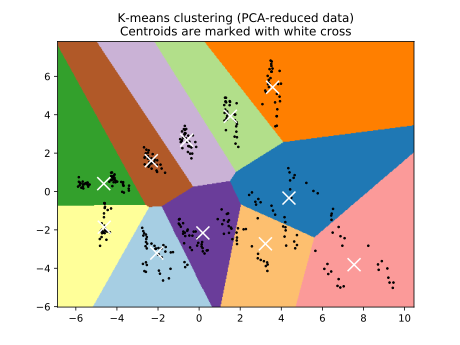
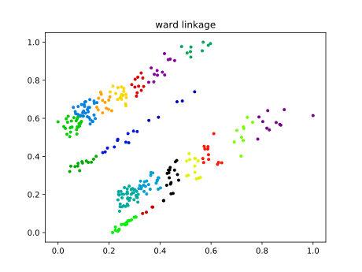

# Samples for Li & Lim (2008) dataset

## _K_-means with 11 clusters

## Agglomerated clustering with 13 clusters

__Note:__ The 13 is just a upper-bound in the number of clusters we allow the algorithm to identify. In practice, there are other threshold parameters that changes the decisions made by the algorithm.

# Samples for Sartori & Buriol (2020)

## _K_-means with 30 clusters

![sartori-kmeans-30/(.github/sartori-kmeans-30.svg)

## Agglomerated clustering with 30 clusters

